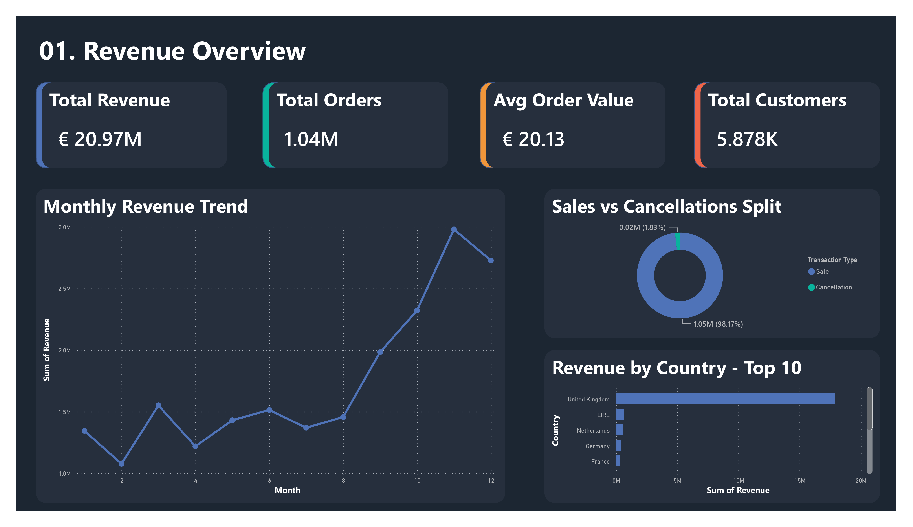
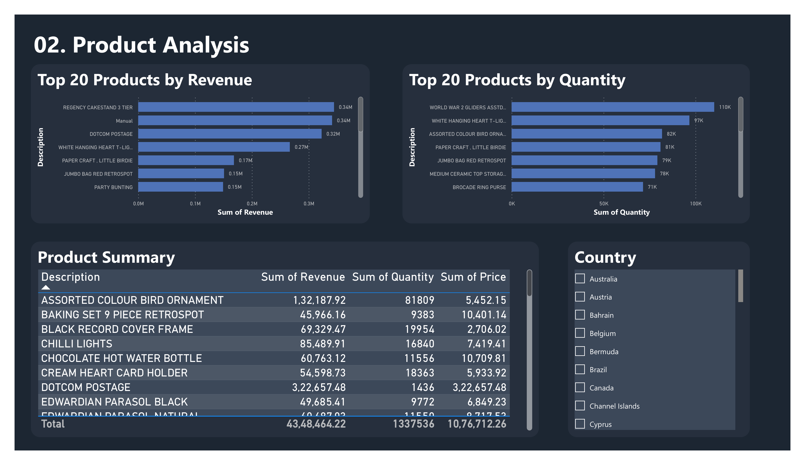
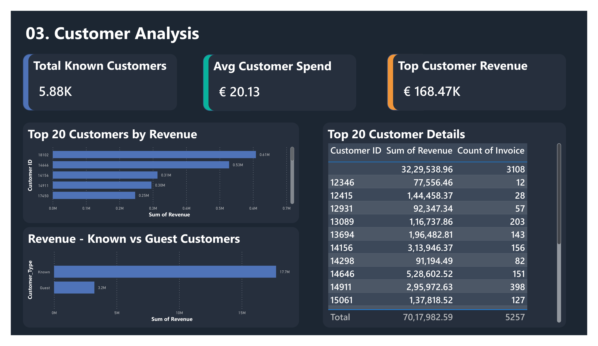
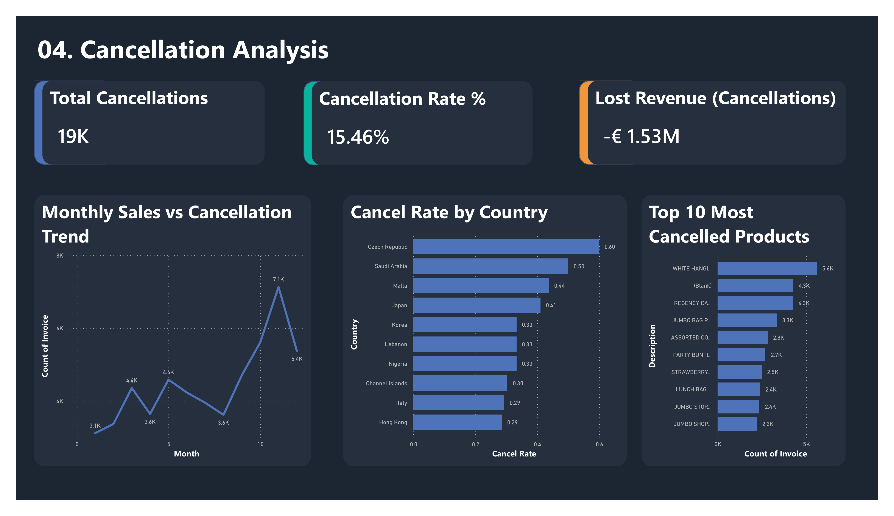
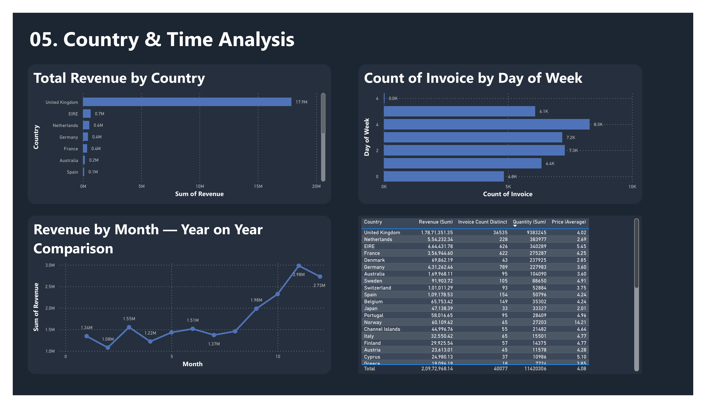

# Online Retail Sales Analytics


> End-to-end retail analytics project on 1.06 million UK online transactions — data quality assessment in Excel, a 12-step Power Query cleaning pipeline, and a five-page interactive Power BI dashboard.

**Goal:** Analyze 1M+ retail transactions to identify revenue drivers, customer behavior patterns, and operational inefficiencies in a UK-based online retail business.

---

## 🎯 What This Project Demonstrates

- Profiled 1,065,371 rows across 8 columns using Excel formula checks (`COUNTBLANK`, `COUNTIF`, `MIN`/`MAX`)
- Built a 12-step Power Query cleaning pipeline adding 7 derived columns and reducing raw data from 8 to 15 columns
- Designed a two-table architecture in Power BI — clean table for sales analysis, raw table for cancellation analysis
- Authored 7 DAX measures including `Cancel Rate` and `Lost Revenue` to power cancellation-specific pages
- Delivered 15 data-backed business findings across revenue, product, customer, cancellation, and geography themes

---

## 🌍 Business Value

This project simulates a real-world retail analytics workflow used to:

- Identify Q4 seasonality patterns and quantify the supply-demand mismatch driving cancellation spikes
- Surface UK market concentration risk and quantify international expansion opportunities by average invoice value
- Quantify the revenue impact of anonymous guest customers and estimate retention conversion potential
- Flag high-concentration B2B accounts and assess single-account revenue risk

---

## 📌 Quick Navigation

- 📦 [Quick Summary](#quick-summary)
- 📈 [Data Scope](#-data-scope)
- 💡 [Key Insights](#-key-insights)
- 📊 [Key Metrics](#-key-metrics-at-a-glance)
- 🏗️ [Architecture Overview](#️-architecture-overview)
- 🚀 [Impact](#-impact)
- 💬 [Recommendations](#-recommendations)
- ⚠️ [Limitations](#️-limitations)
- 🔗 [Pipeline](#pipeline)
- ⚙️ [Tech Stack](#️-tech-stack)
- 🖼️ [Dashboard Preview](#-dashboard-preview)
- 📂 [Repository Structure](#repository-structure)
- ▶️ [Setup](#setup)

---

## Quick Summary

| | |
|---|---|
| 📦 **Dataset** | Online Retail II — UCI Machine Learning Repository |
| 🗃️ **Scale** | 1,065,371 rows · 2 years (Dec 2009 – Dec 2011) · 20 countries · 5,878 known customers |
| ⚙️ **Stack** | Microsoft Excel 2019 · Power Query (M Language) · Power BI Desktop |
| 🧹 **Cleaning** | 12-step Power Query pipeline · 23,700 rows removed · 1,041,671 rows loaded |
| 📊 **Output** | 5-page Power BI dashboard · 7 DAX measures · 15 business findings |

---


## 📈 Data Scope

- Transaction-level retail dataset
- No product cost / margin data available
- No customer demographics available
- No marketing attribution data
- No inventory stock levels available

---

## 💡 Key Insights

*Each insight below represents a decision-impacting business pattern derived from transactional analysis.*

1. **UK generates 85%+ of total revenue** — £17.9M out of £20.97M. A UK-specific disruption would have immediate, material impact. Netherlands (£554K), EIRE (£664K), and Germany (£431K) are the highest-priority diversification targets.

2. **Q4 drives peak revenue** — October (£2.98M) and November (£2.73M) are the top months across both years. The seasonal pattern is consistent year-on-year, with the second year's peak higher — confirming underlying business growth on top of seasonal effects.

3. **22.7% of transactions are anonymous** — 241,958 guest purchases generating £3.2M in revenue are completely untrackable. These customers cannot be re-engaged, segmented, or retained.

4. **Customer spend follows a Pareto distribution** — the top customer (ID 18102) generated £610K alone. The top-to-average spend gap exceeds 8,000x, confirming a B2B wholesale segment within the dataset requiring dedicated account management.

5. **Cancellation spikes align with peak demand** — cancellation volume rises sharply in September–November, the same window as peak sales. This is a supply-side capacity problem, not a pricing problem.

6. **WHITE HANGING HEART T-LIGHT HOLDER is the highest-risk SKU based on combined sales volume and cancellation frequency** — ranked top in both quantity sold (97K units) and cancellations (5,600 cancelled invoices). A supply chain fix on this one product would recover more lost revenue than any country-level intervention.

7. **Netherlands averages £2,430 per invoice vs UK's £489** — a 5x AOV gap indicating wholesale bulk purchasing behaviour. EIRE (£1,061) and Sweden (£875) show the same pattern. A formalized B2B channel for these markets is the highest-ROI geographic expansion path.

8. **Thursday is the peak order day** (8,300 invoices); Sunday is near-zero. This is consistent with a B2B customer base placing orders during the business week — marketing campaigns and warehouse staffing should align accordingly.

---

## 📊 Key Metrics at a Glance

| Metric | Value |
|---|---|
| Total Revenue | £20.97M (GBP) |
| Total Orders | 1,041,671 |
| Avg Order Value | £20.13 |
| Known Customers | 5,878 |
| Guest Revenue (untrackable) | £3.2M (22.7% of transactions) |
| Cancellations | 19,441 invoices |
| Invoice-Based Cancel Rate | 15.46% |
| Lost Revenue (cancellations) | £1.53M |
| Top Customer Revenue | £610K (Customer 18102) |
| UK Revenue Share | £17.9M (85%+) |
| Peak Revenue Month | October — £2.98M |
| Peak Order Day | Thursday — 8,300 invoices |

---

## 🏗️ Architecture Overview

This project follows a layered analytics architecture:

```
Raw Layer → Quality Report → Clean Layer → BI Layer
```

All transformations are recorded as Power Query Applied Steps and re-run automatically on Refresh. A two-table strategy separates clean sales data from the unfiltered raw data required for cancellation analysis — these are never mixed in the same analysis context.

---

## Pipeline

```
Raw Data (online_retail_II.xlsx — 1,065,371 rows)
    ↓
Phase 1 — Data Understanding & Combining
    → Loaded both year tabs into Power Query
    → Verified row counts (523,461 + 541,910 = 1,065,371)
    → Appended into single combined_data query (Append as New)
    → Noted Invoice column auto-detected as Number — flagged for fix
    → Ran full column profiling (entire dataset, not default 1,000 rows)
    → Saved as connection only
    ↓
Phase 2 — Excel Data Quality Report
    → COUNTBLANK, COUNTIF, MIN/MAX on raw tabs
    → Quantified nulls, cancellations, negative quantities, zero prices
    → Documented cleaning decisions for each issue
    ↓
Phase 3 — Power Query Cleaning (12 steps)
    → Fixed Invoice type: Number → Text (required for C-prefix detection)
    → Added 7 derived columns (Transaction_Type, Customer_Type,
       Quantity_Type, Revenue, Month, Year, Day)
    → Trimmed whitespace from Description
    → Filtered: Price > 0, Quantity > 0
    → Removed 23,700 rows → 1,041,671 clean rows loaded to Excel sheet
    ↓
Phase 4 — Excel Analysis (Skipped — Industry Decision)
    → 1,041,671 rows is within Excel's limit, but cancellation analysis
       requires the uncleaned 1,065,371-row table with significant nulls
       in key columns — pivot logic breaks across two large tables
    → Industry standard above 500K rows: move directly to Power BI
    → Pivot table designs documented in annotations for reference
    ↓
Phase 5 — Power BI Dashboard
    → Imported Cleaned_Combined_Data (Pages 1–3, 5 — sales analysis)
    → Imported Uncleaned_Combined_Data (Page 4 — cancellation analysis)
    → Fixed 2 error rows (accounting entries: "Adjust bad debt", "Manual")
    → Created 7 DAX measures
    → Built 5-page interactive dashboard
```

---

## Data Quality Findings

| Issue | Count | % of Dataset | Decision |
|-------|-------|--------------|----------|
| Null Customer IDs | 241,958 | 22.7% | Keep — tag as Guest, exclude from customer-level analysis only |
| Null Descriptions | 4,360 | 0.4% | Remove — product analysis requires a valid name |
| Cancellations (Invoice prefix `C`) | 19,441 | 1.8% | Tag as Cancellation — analyze separately on Page 4 |
| Negative Quantities | 22,889 | 2.1% | Tag as Return — filter from main sales analysis |
| Zero Prices | 6,175 | 0.6% | Remove — distort revenue and avg price calculations |

**Rows retained after cleaning:** 1,041,671 (out of 1,065,371)
**Rows removed:** 23,700

> Note: Removed rows ≠ sum of issue counts. Some records had multiple issues and were counted in more than one category.

---

## Power Query Cleaning — 12 Steps

| Step | Action | Why |
|------|--------|-----|
| 1–2 | Load both year tabs, Append as New → `combined_data` | Single query covering both years |
| 3 | Invoice: Number → Text | Enables `Text.StartsWith()` for C-prefix detection |
| 4 | Add `Transaction_Type` | `if Text.StartsWith([Invoice], "C") then "Cancellation" else "Sale"` |
| 5 | Add `Customer_Type` | `if [Customer ID] = null then "Guest" else "Known"` |
| 6 | Add `Quantity_Type` | `if [Quantity] < 0 then "Return" else "Sale"` |
| 7 | Add `Revenue` | `[Quantity] * [Price]` — primary metric column |
| 8 | Trim `Description` | Removes leading/trailing spaces that create duplicate product entries |
| 9–11 | Extract `Month`, `Year`, `Day` | Required for time-based analysis |
| 12 | Filter `Price > 0`, `Quantity > 0` | Removes zero/negative rows from main dataset |

**Raw columns: 8 → Clean columns: 15** (7 derived columns added)

---

## Two-Table Strategy (Power BI)

| Table | Rows | Contents | Used For |
|-------|------|----------|----------|
| `Cleaned_Combined_Data` | 1,041,671 | Sales only — filtered, 15 columns | Pages 1, 2, 3, 5 |
| `Uncleaned_Combined_Data` | 1,065,371 | All rows — Sales + Cancellations flagged | Page 4 (Cancellation Analysis) |

Cancellation analysis requires rows that were deliberately removed from the clean table. The two-table pattern is the industry-correct approach — clean and raw data are never mixed in the same analysis context.

---

## DAX Measures

```dax
Total Revenue =
SUM('Cleaned_Combined_Data'[Revenue])

Total Orders =
DISTINCTCOUNT('Cleaned_Combined_Data'[Invoice])

Avg Order Value =
DIVIDE([Total Revenue], [Total Orders], 0)

Total Customers =
DISTINCTCOUNT('Cleaned_Combined_Data'[Customer ID])

Total Cancellations =
CALCULATE(
    DISTINCTCOUNT('Uncleaned_Combined_Data'[Invoice]),
    'Uncleaned_Combined_Data'[Transaction_Type] = "Cancellation"
)

Cancel Rate =
DIVIDE(
    CALCULATE(
        DISTINCTCOUNT('Uncleaned_Combined_Data'[Invoice]),
        'Uncleaned_Combined_Data'[Transaction_Type] = "Cancellation"
    ),
    DISTINCTCOUNT('Uncleaned_Combined_Data'[Invoice]),
    0
)

Lost Revenue =
CALCULATE(
    SUM('Uncleaned_Combined_Data'[Revenue]),
    'Uncleaned_Combined_Data'[Transaction_Type] = "Cancellation"
)
```

---

## Dashboard Pages

📊 Dashboard file available in `/dashboard/` (.pbix + PDF preview included)

**Page 1 — Revenue Overview**

KPI cards (Total Revenue £20.97M · Total Orders 1.04M · Avg Order Value £20.13 · Total Customers 5.88K), monthly revenue trend line chart (with Year legend for year-on-year comparison), sales vs cancellations donut (98.17% / 1.83%), revenue by country top 10.

**Page 2 — Product Analysis**

Top 20 products by revenue (REGENCY CAKESTAND 3 TIER leads at £0.34M), top 20 by quantity sold (WORLD WAR 2 GLIDERS at 110K units), product details table with revenue gradient conditional formatting, country slicer cross-filtering all visuals.

**Page 3 — Customer Analysis**

KPI cards (5,878 known customers · avg spend £20.13 · top customer £168.47K), top 20 customers by revenue bar chart, known vs guest revenue split (£17.7M vs £3.2M), top 20 customer details table.

**Page 4 — Cancellation Analysis**

KPI cards (19K cancellations · 15.46% cancel rate · £1.53M lost revenue), monthly sales vs cancellations trend line chart, cancellation rate by country (Czech Republic leads), top 10 most cancelled products.
*Powered entirely by `Uncleaned_Combined_Data`.*

**Page 5 — Country & Time Analysis**

Revenue by country — UK dominates at £17.9M, Thursday peak order day (8.3K invoices), year-on-year monthly revenue line chart, 20-country summary table with revenue gradient.

---

## 🚀 Impact

- **Seasonality insight →** Q4 (Oct–Nov) accounts for peak revenue across both years. Inventory and logistics need to scale 6–8 weeks ahead of this window — not reactively during it.
- **Guest revenue insight →** £3.2M generated by 241,958 unidentifiable transactions. Converting 20% of guest revenue to known customers (≈ £640K) would unlock compounding retention value.
- **Concentration risk →** Top customer (ID 18102) alone generates £610K. The top 5 accounts likely represent 8–10% of total revenue — a material gap if any single account churns.
- **Cancellation recovery →** WHITE HANGING HEART T-LIGHT HOLDER leads all products in cancelled invoices (5,600). Fixing this one SKU's supply chain would recover more lost revenue than addressing any country-level cancellation issue.
- **Geographic opportunity →** Netherlands averages £2,430 per invoice vs UK's £489. A formalized B2B wholesale channel for Netherlands, EIRE, and Sweden would increase revenue per customer relationship and diversify geographic concentration.

---

## 💬 Recommendations

- **Build inventory buffers for top cancellation SKUs 6–8 weeks before Q4** — supply-demand mismatch, not pricing, is driving the September–November cancellation spike.
- **Introduce guest-to-registered conversion incentives at checkout** — 22.7% of revenue is untrackable; a small checkout incentive converts a meaningful share to retainable customers.
- **Formalize a B2B channel for Netherlands, EIRE, and Sweden** — £2,430 average invoice value signals wholesale buying behaviour. Volume-based pricing tiers and dedicated account management would increase yield per customer relationship.
- **Shift marketing campaigns to Tuesday–Thursday** — Thursday is peak (8.3K invoices); Sunday is near-zero. B2B buyers place orders mid-week — campaign timing should reflect this.
- **Exclude DOTCOM POSTAGE from all product KPIs** — shipping fees logged as product entries distort top-product rankings and revenue calculations. This is a data governance fix, not an analysis workaround.
- **Assign relationship management to top 5 accounts** — Customer 18102 alone represents ~3% of total revenue. Losing one wholesale account creates an immediate revenue gap with no short-term replacement path.

---

## ⚠️ Limitations

- **Customer IDs are missing for 22.7% of transactions** — guest purchases are revenue-visible but customer-invisible. All customer-level metrics (count, avg spend, retention) reflect known customers only.
- **Cancellation reasons are not recorded** — whether cancellations reflect stockouts, fraud, or buyer remorse cannot be determined from this dataset alone. Root cause analysis requires operational data not present here.
- **DOTCOM POSTAGE distorts product revenue rankings** — shipping fees logged as product entries inflate revenue for a non-product line item. Excluded from product analysis but present in raw data.
- **No marketing or acquisition channel data** — revenue attribution to campaigns, channels, or promotions is not possible from this dataset.
- **Invoice-based cancel rate (15.46%) vs row-based (1.8%) differ significantly** — the row-based rate counts individual product lines; the invoice-based rate counts distinct invoice numbers prefixed with `C`. Both are valid measures of different things; care is needed when quoting either.

---

## ⚙️ Tech Stack

| Tool | Purpose |
|------|---------|
| Microsoft Excel 2019 | Data quality report, raw formula checks |
| Power Query (M Language) | Data transformation, derived columns, filtering |
| Power BI Desktop | 5-page interactive dashboard, DAX measures |

**This project built using Excel and Power BI, following a business analyst–style workflow without external scripting dependencies.**

---

## Problems Faced & Solutions

| Problem | Cause | Solution |
|---------|-------|----------|
| `combined_data` not visible in Power BI Navigator | Power BI cannot read Excel Data Models | Loaded as named Excel Table (`Cleaned_Combined_Data`) to sheet first |
| `DataFormat.Error` on Invoice column | Invoice loaded as Number; C-prefixed values can't convert | Changed Invoice type to Text in Power BI Power Query |
| 2 error rows in Power BI | Accounting entries (`Adjust bad debt`, `Manual`) with no stock code | Removed via Home → Remove Errors (2 rows out of 1M+, negligible) |
| `Transaction_Type` only showed `Sale` | Cancellations filtered out during Excel cleaning step | Created separate `Uncleaned_Combined_Data` table for Page 4 |
| `Lost Revenue` measure error | Revenue column in uncleaned table auto-loaded as Text | Changed Revenue type to Decimal Number in Power BI Power Query |

---

## Repository Structure

```
online-retail-analysis/
│
├── .gitignore
├── environment.yml
├── Makefile
├── Readme.md
├── requirements.txt
│
├── annotations/
│   ├── Phase 00 - Planning.md
│   ├── Phase 01 - Data Understanding & Combining.md
│   ├── Phase 02 - Data quality report.md
│   ├── Phase 03 - Power Query Cleaning Notes.md
│   ├── Phase 05 - Power BI Dashboard Notes.md
│   └── Source.md
│
├── dashboard/
│   ├── online_retail_dashboard.pbit
│   ├── online_retail_dashboard.pbix
│   ├── online_retail_dashboard.pdf
│   └── images/
│       ├── 01_revenue_overview.png
│       ├── 02_product_analysis.png
│       ├── 03_customer_analysis.png
│       ├── 04_cancellation_analysis.png
│       └── 05_country_and_time_analysis.png
│
├── data/
│   └── online_retail_II.xlsx              ← raw file — never modified
│
├── docs/
│   ├── business_insights_report.md        ← 15 business questions with data-backed answers
│   └── data_quality_report.md             ← null analysis, cleaning rules, row counts
│
├── excel/
│   └── online_retail_working.xlsx         ← single working file
│       ├── Sheet: Data_Quality_Report     ← Phase 2 formula checks
│       ├── Sheet: Year 2009-2010          ← raw tab (source for formulas)
│       ├── Sheet: Year 2010-2011          ← raw tab (source for formulas)
│       ├── Sheet: Cleaned_Combined_Data   ← 1,041,671 clean rows (Phase 3 output)
│       └── Power Query: combined_data     ← 12-step cleaning pipeline
│
└── scripts/
    └── convert_dashboard_pdf.py
```

---

## How to Explore This Project

1. **Start with Key Insights** — business findings at a glance above
2. **Read `docs/business_insights_report.md`** — 15 analytical findings with data-backed answers and recommendations
3. **Open `docs/data_quality_report.md`** — full null analysis, cleaning decisions, and formula evidence
4. **Open `excel/online_retail_working.xlsx`** — Power Query pipeline and cleaned data
5. **Open `dashboard/online_retail_dashboard.pbix`** in Power BI Desktop — final five-page output

---

## Setup

### Prerequisites

- Microsoft Excel 2019 or later
- Power BI Desktop (free from Microsoft)

### Steps

1. Download the dataset from [UCI Machine Learning Repository](https://archive.ics.uci.edu/dataset/502/online+retail+ii) and place `online_retail_II.xlsx` inside the `data/` folder.

2. Open `excel/online_retail_working.xlsx`. If prompted to refresh connections, allow it. Power Query will re-run all 12 cleaning steps against the raw file automatically.

3. Open `dashboard/online_retail_dashboard.pbix` in Power BI Desktop. If the data source path has changed, update it via:
   ```
   Home → Transform Data → Data Source Settings → Change Source
   ```
   Point it to your local `excel/online_retail_working.xlsx`.

4. Click **Refresh** in Power BI to reload all data.

---

## Data Source

| Source | Rows | Description |
|--------|------|-------------|
| [Online Retail II — UCI Machine Learning Repository](https://archive.ics.uci.edu/dataset/502/online+retail+ii) | 1,065,371 | Real transaction data from a UK-based online retailer, donated by the London School of Economics |

---

## 🔗 Dashboard Access

- Power BI file: `/dashboard/online_retail_dashboard.pbix`
- Exported report: `/dashboard/online_retail_dashboard.pdf`

---

## Lessons Learned

- **Wrong data type = downstream formula errors** — Invoice being auto-detected as Number caused `Transaction_Type` to error on every row. Checking data types before adding calculated columns is a non-negotiable first step.
- **Append ≠ Merge** — Append stacks rows (union); Merge joins columns (like SQL JOIN). Using the wrong one on a 1M-row dataset is a silent, hard-to-debug error.
- **Power BI cannot read Excel Data Models** — the clean table must be loaded as a named Excel Table to a sheet before Power BI can import it. This is a known limitation worth documenting upfront.
- **Two-table architecture is the correct pattern for exception analysis** — cancellation analysis needs rows that were deliberately cleaned out of the main table. Mixing clean and raw data in the same context produces incorrect metrics.
- **Invoice-level vs row-level counts tell different stories** — a 1.8% row-based cancellation rate and a 15.46% invoice-based rate both describe the same dataset. Context determines which is the right metric to quote.

---

*This project demonstrates end-to-end analytics capability from raw data profiling to business decision-making insights.*

---

## Full Project Availability

This repository showcases the core architecture, methodology, and selected outputs of the project.

The complete implementation is maintained in a private repository because it contains proprietary work, large datasets, or materials that cannot be shared publicly.

Recruiters and hiring managers interested in reviewing the full project may contact me via LinkedIn or email to arrange access or a walkthrough.
